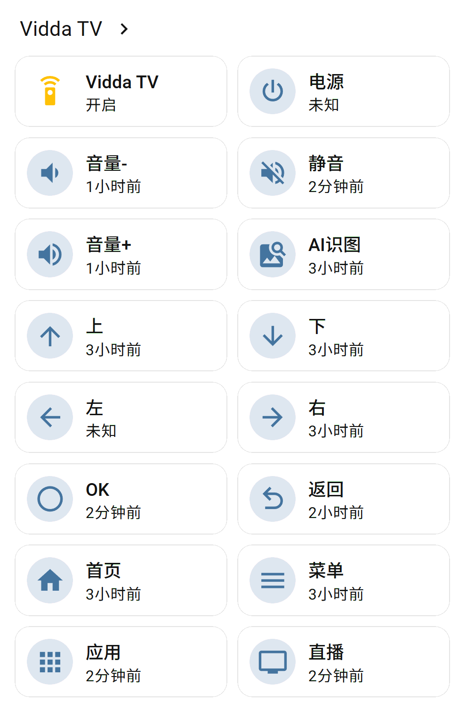

# vidda_fish

Home Assistant custom integration: local MQTT control for Hisense VIDDA TVs.

Target device: **Vidda 85V7N Ultra**

## Author

- x9fish
- Email: x9fish@gmail.com
- GitHub: https://github.com/x9fish/vidda_fish

Credits: Written by DeepSeek and ChatGPT (web). Code belongs to the internet.

## Features

- 15 remote keys (power, volume, mute, dpad, OK, back, home, menu, apps, live, AI)
- Shared long-lived MQTT connection (one per TV)
- Auto reconnect
- `remote` entity with `remote.send_command`
- 15 `button` entities

## Install

### HACS

1. HACS -> Integrations -> three dots -> Custom repositories
2. URL: `https://github.com/x9fish/vidda_fish`, category: Integration
3. Install -> restart HA

### Manual

1. Copy `vidda_fish` folder to `/config/custom_components/`
2. Restart HA

## Configure

1. Settings -> Devices & Services -> Add Integration -> search `vidda_fish`
2. Fill: TV IP, MQTT port (default 36669), TV client ID (32-char hex),
   MQTT username (default `hisenseservice`), MQTT password (default `multimqttservice`)

## Supported keys

| Payload | Description |
|---|---|
| KEY_POWER | Power |
| KEY_VOLUMEUP | Volume up |
| KEY_VOLUMEDOWN | Volume down |
| KEY_MUTE | Mute |
| KEY_UP x Up |
| KEY_DOWN | Down |
| KEY_LEFT | Left |
| KEY_RIGHT | Right |
| KEY_OK | OK |
| KEY_RETURNS | Back |
| KEY_HOME | Home |
| KEY_MENU | Menu |
| KEY_APPS | Apps |
| KEY_LIVE | Live |
| KEY_JUBAO | AI image |

## Usage

```yaml
service: remote.send_command
target:
  entity_id: remote.vidda_tv
data:
  command:
    - home
    - volume_up
    - KEY_OK
```

## Limitations

- Input source / Settings keys not supported: they go through the Hisense cloud MQTT (public port 1883), not the local 36669).
- Only for VIDDA firmwares without client certificate requirement.
- State not reflected: `remote.is_on` is always True.

## Protocol

- Local MQTT broker: `{TV_IP}:36669`
- Auth: `hisenseservice` / `multimqttservice`
- Protocol: MQTT 5
- Control topic: `/remoteapp/tv/hiservice_cmd/{TV_CLIENT_ID}/actions/sendkey`
- Status topic: `/remoteapp/mobile/broadcast/#`

## License

MIT
